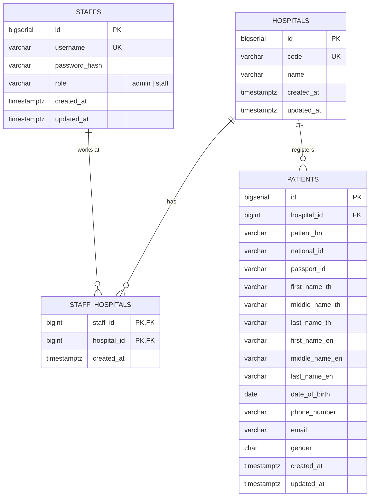

# Hospital Middleware — Architecture Reference

เอกสารนี้อธิบาย architecture ของ Go backend สำหรับระบบ Hospital Middleware ที่ให้เจ้าหน้าที่โรงพยาบาล (staff) ค้นหาข้อมูลผู้ป่วยจาก Hospital Information System (HIS) โดย staff ค้นหาได้เฉพาะผู้ป่วยในโรงพยาบาลเดียวกับตัวเองเท่านั้น และมี admin ทำหน้าที่สร้างบัญชี staff

ใช้เอกสารนี้เป็น source of truth ในการพัฒนา ถ้ามีจุดไหนไม่ชัดเจน ให้ยึดตาม "Design Decisions & Assumptions" ด้านล่าง ถ้ายังไม่ชัดให้ถามก่อนเขียนโค้ด

---

## Tech Stack

| ส่วน | เทคโนโลยี |
|---|---|
| Language | Go 1.27 |
| HTTP Framework | [Gin](https://github.com/gin-gonic/gin) |
| ORM | GORM + PostgreSQL driver (`gorm.io/driver/postgres`) |
| Migration | GORM `AutoMigrate()` |
| Database | PostgreSQL 18 |
| Auth | JWT (`github.com/golang-jwt/jwt/v5`) + bcrypt (`golang.org/x/crypto/bcrypt`) |
| Config | `github.com/kelseyhightower/envconfig` |
| Unit Test | `testing` + `testify` (assert/require/mock) + `mockery` (generate mocks) |
| Integration Test DB | PostgreSQL จริงผ่าน `testcontainers-go` (`modules/postgres`) |
| Reverse Proxy | Nginx |
| Container | Docker + Docker Compose |

ใช้ library เวอร์ชันล่าสุดที่ stable ทั้งหมด

---

## โครงสร้าง Directory

```
.
├── cmd/
│   └── main.go                  # entry point, flag: --with-migrate
├── di/
│   ├── di.go                    # InitApplication() — wiring ทุกอย่าง
│   ├── server/server.go         # BuildApp() → *gin.Engine, InitApiServer()
│   ├── config/config.go         # AppConfig struct + GetConfig()
│   └── database/database.go     # InitDatabase() → *gorm.DB
├── entity/
│   ├── hospital.go              # GORM model
│   ├── staff.go                 # GORM model + StaffResponse + ToResponse() + role constants
│   ├── staff_hospital.go        # GORM model ตาราง mapping staff ↔ hospital
│   ├── patient.go               # GORM model + PatientResponse + ToResponse()
│   ├── date.go                  # type Date (JSON "YYYY-MM-DD", Scanner/Valuer)
│   └── migrator/migrator.go     # AutoMigrate() + indexes + seed hospitals & admin
├── client/
│   └── his/
│       ├── his.go               # HISClient interface + HISPatient DTO + ProvideHISClient()
│       ├── http_client.go       # เรียก HIS จริงผ่าน HTTP
│       └── mock_client.go       # fake HIS ใน app (HIS_MODE=mock)
├── repository/
│   ├── hospital/
│   │   ├── hospital.go          # interface + struct + ProvideHospitalRepository()
│   │   └── find_by_code.go
│   ├── staff/
│   │   ├── staff.go
│   │   ├── create_with_hospital.go   # สร้าง staff + mapping ใน transaction เดียว
│   │   ├── find_by_username.go
│   │   └── has_hospital.go           # ตรวจว่า staff มี mapping กับ hospital นี้
│   └── patient/
│       ├── patient.go
│       ├── search.go
│       └── upsert.go
├── service/                     # business logic (ไม่รู้จัก gin)
│   ├── admin/
│   │   ├── admin.go             # interface + struct + ProvideAdminService()
│   │   └── login.go             # อ่านจากตาราง staffs โดยเช็ก role = admin
│   ├── staff/
│   │   ├── staff.go
│   │   ├── create.go
│   │   └── login.go
│   └── patient/
│       ├── patient.go
│       └── search.go
├── handler/                     # HTTP layer (gin)
│   ├── router.go                # InitRouter() — mount routes ทุก domain
│   ├── middleware/
│   │   ├── require_auth.go      # ตรวจ JWT แล้ว inject claims เข้า context
│   │   ├── require_role.go      # RequireRole(role) ตรวจ role ใน claims
│   │   └── logger.go            # log แบบไม่มี query string
│   ├── admin/
│   │   ├── admin.go
│   │   └── login.go
│   ├── staff/
│   │   ├── staff.go
│   │   ├── create.go
│   │   └── login.go
│   └── patient/
│       ├── patient.go
│       └── search.go
├── util/
│   ├── apperror.go              # AppError + error codes
│   ├── response.go              # helper เขียน JSON response / error
│   ├── jwt.go                   # GenerateToken(), ParseToken()
│   ├── password.go              # HashPassword(), CheckPassword()
│   └── auth.go                  # GetClaims(c *gin.Context)
├── testsuite/
│   └── postgres.go              # เปิด Postgres container สำหรับ integration test
├── mocks/                       # generated โดย mockery (ห้ามแก้ด้วยมือ)
├── nginx/
│   └── nginx.conf
├── docs/
│   └── er-diagram.md            # Mermaid ER diagram
├── .mockery.yaml
├── Dockerfile
├── docker-compose.yml
├── Makefile
├── .env.example
└── README.md
```

---

## Layered Architecture

```
HTTP Request
    │
    ▼
[Nginx]  :80  → reverse proxy ไป app:8080
    │
    ▼
[Gin Middleware]
  - gin.Recovery()
  - Logger (ไม่ log query string)
  - RequireAuth            ← เฉพาะ route ที่ต้อง login
  - RequireRole(role)      ← ตรวจว่าเป็น admin หรือ staff
    │
    ▼
[Handler Layer]  handler/<domain>/
  - bind + validate request (binding tags)
  - ดึง claims จาก context: util.GetClaims(c)
  - เรียก service ด้วย c.Request.Context()
  - แปลง AppError → HTTP status + JSON
    │
    ▼
[Service Layer]  service/<domain>/
  - business logic ทั้งหมด (hash password, สร้าง JWT, ตัดสินใจเรียก HIS)
  - รับ context.Context ไม่รู้จัก gin
  - คืน entity/DTO หรือ *util.AppError
    │
    ├──────────────► [HIS Client]  client/his/
    ▼
[Repository Layer]  repository/<domain>/
  - รับ context.Context
  - ใช้ GORM query: db.WithContext(ctx)
  - คืน entity struct
    │
    ▼
[Entity Layer]  entity/*.go
  - GORM model (table schema)
  - Response structs (DTO)
  - ToResponse() mapping methods
```

แยก handler กับ service ออกจากกัน (ต่างจาก template เดิมที่ service รับ `*fiber.Ctx`) เพื่อให้ unit test business logic ได้โดยไม่ต้องสร้าง HTTP request

---

## Dependency Injection Pattern

ไม่มี DI framework ใช้ manual wiring ผ่าน `Provide*()` functions ทุก layer รับ dependency เป็น **interface** เพื่อให้ mock ได้ตอนเทสต์

```go
// Repository
type StaffRepository interface {
    CreateWithHospital(ctx context.Context, staff *entity.Staff, hospitalID uint) error
    FindByUsername(ctx context.Context, username string) (*entity.Staff, error)
    HasHospital(ctx context.Context, staffID, hospitalID uint) (bool, error)
}

func ProvideStaffRepository(db *gorm.DB) StaffRepository {
    return &staffRepository{db: db}
}

// Service รับ interface ของ repository เข้ามา (ไม่สร้างเอง)
func ProvideStaffService(
    cfg config.AppConfig,
    staffRepo staff.StaffRepository,
    hospitalRepo hospital.HospitalRepository,
) StaffService {
    return &staffService{cfg: cfg, staffRepo: staffRepo, hospitalRepo: hospitalRepo}
}
```

Wiring ทั้งหมดอยู่ที่ `di/di.go` ที่เดียว

---

## Configuration (Environment Variables)

โหลดผ่าน `envconfig` ใน `di/config/config.go`

```env
# Server
APP_PORT=8080
GIN_MODE=release              # debug | release | test

# Database (PostgreSQL)
DB_HOST=db
DB_PORT=5432
DB_USER=postgres
DB_PASSWORD=postgres
DB_NAME=hospital_middleware
DB_SSLMODE=disable

# Auth
JWT_SECRET=change-me          # required, อย่างน้อย 32 ตัวอักษร
JWT_TTL=24h

# Initial admin (ใช้ตอน --with-migrate เท่านั้น)
ADMIN_USERNAME=admin
ADMIN_PASSWORD=change-me-please

# HIS
HIS_MODE=mock                 # mock | http
HIS_TIMEOUT=5s
HIS_BASE_URLS=hospital-a:https://hospital-a.api.co.th,hospital-b:https://hospital-b.api.co.th
```

`HIS_BASE_URLS` คือ map จาก hospital code → base URL ของ HIS (envconfig อ่านเป็น `map[string]string` ได้ในรูปแบบ `key:value,key:value`) ใช้เฉพาะตอน `HIS_MODE=http`

---

## Database Schema

ER diagram (Mermaid) อยู่ที่ `docs/er-diagram.md`



### Constraints & Indexes

| ตาราง | Constraint / Index |
|---|---|
| hospitals | `UNIQUE (code)` |
| staffs | `UNIQUE (username)` (unique ทั้งระบบ เพราะ 1 แถว = 1 คน) |
| staffs | `CHECK (role IN ('admin','staff'))` |
| staff_hospitals | `PRIMARY KEY (staff_id, hospital_id)`, FK ทั้งสองตัว `ON DELETE CASCADE`, index `(hospital_id)` |
| patients | `UNIQUE (hospital_id, patient_hn)`, FK `hospital_id → hospitals.id` |
| patients | `UNIQUE (hospital_id, national_id) WHERE national_id IS NOT NULL` |
| patients | `UNIQUE (hospital_id, passport_id) WHERE passport_id IS NOT NULL` |
| patients | `CHECK (gender IN ('M','F'))` |
| patients | index `(hospital_id, last_name_en)`, `(hospital_id, last_name_th)`, `(hospital_id, phone_number)`, `(hospital_id, email)` |

- กฎ "staff ต้องมีอย่างน้อย 1 โรงพยาบาล" และ "admin ต้องไม่มี mapping" บังคับที่ DB ไม่ได้ (ต้องใช้ trigger) จึงบังคับใน service layer แทน
- field ที่ไม่มีค่าให้เก็บเป็น `NULL` ไม่ใช่ `""` (ใช้ `*string` ใน GORM model) เพื่อให้ partial unique index ทำงานถูก
- สร้าง index ผ่าน GORM tag เช่น `gorm:"uniqueIndex:uq_patient_national,where:national_id IS NOT NULL"` ถ้า tag ทำไม่ได้ (เช่น `CHECK`) ให้รัน raw SQL แบบ idempotent (`IF NOT EXISTS`) ใน `migrator.go` หลัง `AutoMigrate()`

### Seed Data (รันตอน `--with-migrate`)

**hospitals**

| code | name |
|---|---|
| `hospital-a` | Hospital A |
| `hospital-b` | Hospital B |

`hospital-b` มีไว้ทดสอบว่า staff ข้ามโรงพยาบาลไม่เห็นผู้ป่วยของกันและกัน

**admin**: สร้างแถวใน `staffs` ด้วย `role = 'admin'` จาก `ADMIN_USERNAME` / `ADMIN_PASSWORD` โดยไม่มี mapping ใน `staff_hospitals`
- ถ้ามี username นี้อยู่แล้ว ไม่ต้องทำอะไร (ห้ามเขียนทับ password)
- ถ้าไม่ได้ตั้ง env ทั้งสองตัว ให้ข้ามการสร้าง admin และ log warning

seed ทั้งหมดต้อง idempotent (รันซ้ำได้โดยไม่ error และไม่สร้างข้อมูลซ้ำ)

---

## Authentication & Authorization

### Roles

| role | เงื่อนไข | ทำอะไรได้ |
|---|---|---|
| `admin` | `staffs.role = 'admin'` ไม่มี mapping | สร้าง staff ให้โรงพยาบาลไหนก็ได้ **เท่านั้น** ค้นหาผู้ป่วยไม่ได้ |
| `staff` | `staffs.role = 'staff'` มี mapping ≥ 1 | ค้นหาผู้ป่วยได้เฉพาะโรงพยาบาลที่เลือกตอน login สร้าง staff ไม่ได้ |

staff หนึ่งคนสังกัดได้หลายโรงพยาบาลผ่าน `staff_hospitals` ค่า `hospital` ที่ส่งตอน login คือการเลือกว่า session นี้ทำงานในโรงพยาบาลไหน token ที่ได้จะผูกกับโรงพยาบาลนั้นเท่านั้น

### JWT Claims

```json
// admin
{ "sub": "1", "role": "admin", "iat": 0, "exp": 0 }

// staff
{ "sub": "5", "role": "staff", "hospital_id": 1, "hospital_code": "hospital-a", "iat": 0, "exp": 0 }
```

ใช้ HS256 และตรวจ `alg` ตอน parse (ปฏิเสธ `none` และ alg อื่น)

### Middleware

- `RequireAuth`: อ่าน `Authorization: Bearer <token>` → `util.ParseToken()` ตรวจ signature, alg, exp → ผ่านแล้ว `c.Set("claims", claims)` ไม่ผ่านตอบ `401 UNAUTHORIZED`
- `RequireRole(role string)`: ใช้ต่อจาก `RequireAuth` ถ้า role ใน claims ไม่ตรงตอบ `403 FORBIDDEN`

Handler ดึง claims ด้วย `util.GetClaims(c)`

---

## API Spec

ทุก request body/response เป็น JSON

### Response Format

สำเร็จ:
```json
{ "data": { ... } }
```

ผิดพลาด:
```json
{ "error": { "code": "VALIDATION_ERROR", "message": "username is required" } }
```

### Error Codes

| code | HTTP | ใช้เมื่อ |
|---|---|---|
| `VALIDATION_ERROR` | 400 | input ผิดรูปแบบ |
| `UNAUTHORIZED` | 401 | ไม่มี token / token ไม่ถูกต้องหรือหมดอายุ |
| `INVALID_CREDENTIALS` | 401 | login ไม่สำเร็จ |
| `FORBIDDEN` | 403 | login แล้วแต่ role ไม่มีสิทธิ์ |
| `HOSPITAL_NOT_FOUND` | 404 | ไม่พบ hospital code |
| `USERNAME_TAKEN` | 409 | username มีอยู่แล้วในระบบ |
| `HIS_UNAVAILABLE` | 502 | เรียก HIS ไม่สำเร็จ (timeout, 5xx) |
| `INTERNAL_ERROR` | 500 | error อื่นๆ (ห้ามส่งรายละเอียด error ภายในออกไป) |

### Routes

| Method | Path | Auth | คำอธิบาย |
|---|---|---|---|
| GET | `/health` | ไม่ต้อง | Health check (ping DB) |
| POST | `/admin/login` | ไม่ต้อง | admin login รับ JWT |
| POST | `/staff/create` | JWT role `admin` | สร้าง staff |
| POST | `/staff/login` | ไม่ต้อง | staff login รับ JWT |
| GET | `/patient/search` | JWT role `staff` | ค้นหาผู้ป่วย |

### POST `/admin/login`

Request:
```json
{ "username": "admin", "password": "change-me-please" }
```

Response `200`:
```json
{ "data": { "access_token": "eyJ...", "token_type": "Bearer", "expires_in": 86400 } }
```

Errors: `400 VALIDATION_ERROR`, `401 INVALID_CREDENTIALS`

หา staff จาก username แล้วตรวจ `role = 'admin'` ถ้าเป็นบัญชี staff ก็ตอบ `401 INVALID_CREDENTIALS` เช่นกัน

### POST `/staff/create`

Header: `Authorization: Bearer <admin token>`

Request:
```json
{ "username": "nurse01", "password": "P@ssw0rd123", "hospital": "hospital-a" }
```
Validation: `username` 3–50 ตัว (a-z, 0-9, `_`, `.`), `password` 8–72 ตัว (72 คือเพดานของ bcrypt), `hospital` required

ขั้นตอน: หา hospital จาก code → สร้างแถวใน `staffs` (`role = 'staff'`) และแถวใน `staff_hospitals` ใน **transaction เดียวกัน** ถ้าขั้นใดล้มเหลวให้ rollback ทั้งหมด

ถ้า username มีอยู่แล้ว (แม้จะอยู่คนละโรงพยาบาล) ตอบ `409` การเพิ่มโรงพยาบาลให้ staff เดิมอยู่นอก scope (ดู Future Work)

Response `201`:
```json
{ "data": { "id": 2, "username": "nurse01", "hospital": "hospital-a", "created_at": "2026-09-19T10:00:00Z" } }
```
ห้ามคืน `password_hash` เด็ดขาด

Errors: `400 VALIDATION_ERROR`, `401 UNAUTHORIZED`, `403 FORBIDDEN`, `404 HOSPITAL_NOT_FOUND`, `409 USERNAME_TAKEN`

### POST `/staff/login`

Request:
```json
{ "username": "nurse01", "password": "P@ssw0rd123", "hospital": "hospital-a" }
```

Response `200`:
```json
{ "data": { "access_token": "eyJ...", "token_type": "Bearer", "expires_in": 86400 } }
```

Errors: `400 VALIDATION_ERROR`, `401 INVALID_CREDENTIALS`

ขั้นตอน: หา staff จาก username → ตรวจ `role = 'staff'` → ตรวจ password → หา hospital จาก code → ตรวจว่ามี mapping ใน `staff_hospitals` → ออก token ที่มี `hospital_id` นั้น

ไม่ว่าจะเป็น username ไม่มี, password ผิด, hospital ไม่มี, ไม่มี mapping กับ hospital นั้น หรือเป็นบัญชี admin ให้ตอบ `401 INVALID_CREDENTIALS` ข้อความเดียวกัน เพื่อไม่ให้เดาได้ว่า username ไหนมีอยู่ (admin ต้องใช้ `/admin/login`)

### GET `/patient/search`

Header: `Authorization: Bearer <staff token>`

Query parameters (ทุกตัว optional):

| param | ตัวอย่าง | validation |
|---|---|---|
| `national_id` | `1234567890123` | ตัวเลข 13 หลัก |
| `passport_id` | `AA1234567` | 1–20 ตัว |
| `first_name` | `Somchai` | ≤ 100 ตัว |
| `middle_name` | | ≤ 100 ตัว |
| `last_name` | `Jaidee` | ≤ 100 ตัว |
| `date_of_birth` | `1990-05-20` | `YYYY-MM-DD` |
| `phone_number` | `0812345678` | ≤ 20 ตัว |
| `email` | `somchai@example.com` | รูปแบบ email |
| `limit` | `20` | 1–100, default 20 |
| `offset` | `0` | ≥ 0, default 0 |

ตัวอย่าง:
```
GET /patient/search?first_name=Somchai&date_of_birth=1990-05-20
```

ใช้ `c.ShouldBindQuery()` กับ struct ที่มี `form` + `binding` tags

Response `200`:
```json
{
  "data": [
    {
      "patient_hn": "HN0001",
      "national_id": "1234567890123",
      "passport_id": null,
      "first_name_th": "สมชาย",
      "middle_name_th": null,
      "last_name_th": "ใจดี",
      "first_name_en": "Somchai",
      "middle_name_en": null,
      "last_name_en": "Jaidee",
      "date_of_birth": "1990-05-20",
      "phone_number": "0812345678",
      "email": "somchai@example.com",
      "gender": "M"
    }
  ],
  "meta": { "limit": 20, "offset": 0, "count": 1 }
}
```
ไม่พบผลลัพธ์ให้คืน `200` กับ `"data": []` (ไม่ใช่ 404)

Errors: `400 VALIDATION_ERROR`, `401 UNAUTHORIZED`, `403 FORBIDDEN`, `502 HIS_UNAVAILABLE`

---

## Patient Search Logic

1. `hospital_id` และ `hospital_code` เอาจาก JWT claims **เท่านั้น** ห้ามรับจาก query parameter
2. สร้าง query บนตาราง `patients` โดยใส่ `WHERE hospital_id = ?` เสมอ แล้วเพิ่มเงื่อนไขตาม param ที่ส่งมา (AND กันทั้งหมด):

| param | การจับคู่ |
|---|---|
| `national_id`, `passport_id`, `phone_number`, `date_of_birth` | ตรงตัว |
| `email` | ตรงตัวแบบไม่สนตัวพิมพ์ (`LOWER(email) = LOWER(?)`) |
| `first_name` | `first_name_th ILIKE ? OR first_name_en ILIKE ?` (partial) |
| `middle_name` | `middle_name_th ILIKE ? OR middle_name_en ILIKE ?` (partial) |
| `last_name` | `last_name_th ILIKE ? OR last_name_en ILIKE ?` (partial) |

   - trim ช่องว่างหน้า-หลัง param ที่เป็น string ถ้า trim แล้วว่างถือว่าไม่ได้ส่ง
   - escape อักขระ `%`, `_`, `\` ใน input ก่อนใส่ใน ILIKE
   - ครอบเงื่อนไข OR ด้วยวงเล็บเสมอ เพื่อไม่ให้หลุดออกจาก `hospital_id = ?`
   - ใช้ parameterized query เสมอ ห้ามต่อ string เป็น SQL
   - เรียงผลลัพธ์ด้วย `id ASC` แล้วใช้ `limit/offset`
3. **HIS fallback**: ถ้า request มี `national_id` หรือ `passport_id` และค้นใน DB ไม่เจอ
   - เรียก HIS ของโรงพยาบาลของ staff: `hisClient.SearchPatient(ctx, hospitalCode, id)` (ใช้ `national_id` ก่อน ถ้าไม่มีใช้ `passport_id`)
   - HIS ตอบ 200 → upsert ลง `patients` (`ON CONFLICT (hospital_id, patient_hn) DO UPDATE`) แล้วค้นใน DB ซ้ำด้วยเงื่อนไขเดิม (ถ้า param อื่นไม่ตรงก็ได้ `[]`)
   - HIS ตอบ 404 → คืน `[]`
   - โรงพยาบาลนี้ไม่มี HIS ตั้งค่าไว้ → คืน `[]` และ log warning
   - HIS timeout / 5xx / response parse ไม่ได้ → `502 HIS_UNAVAILABLE`
4. ถ้าไม่มี `national_id` / `passport_id` จะไม่เรียก HIS (HIS API ค้นด้วยชื่อไม่ได้)

---

## HIS Client

```go
type HISPatient struct {
    FirstNameTH  string `json:"first_name_th"`
    MiddleNameTH string `json:"middle_name_th"`
    LastNameTH   string `json:"last_name_th"`
    FirstNameEN  string `json:"first_name_en"`
    MiddleNameEN string `json:"middle_name_en"`
    LastNameEN   string `json:"last_name_en"`
    DateOfBirth  string `json:"date_of_birth"`
    PatientHN    string `json:"patient_hn"`
    NationalID   string `json:"national_id"`
    PassportID   string `json:"passport_id"`
    PhoneNumber  string `json:"phone_number"`
    Email        string `json:"email"`
    Gender       string `json:"gender"`
}

var (
    ErrPatientNotFound  = errors.New("his: patient not found")
    ErrHISNotConfigured = errors.New("his: hospital not configured")
)

type HISClient interface {
    SearchPatient(ctx context.Context, hospitalCode, id string) (*HISPatient, error)
}
```

- `ProvideHISClient(cfg)` เลือก implementation ตาม `HIS_MODE`
- `http_client.go`: หา base URL จาก `cfg.HISBaseURLs[hospitalCode]` ถ้าไม่มีคืน `ErrHISNotConfigured` แล้วเรียก `GET {base_url}/patient/search/{id}` ด้วย `http.Client` ที่ตั้ง timeout จาก `HIS_TIMEOUT`, `url.PathEscape(id)` ก่อนต่อ URL, map 404 → `ErrPatientNotFound`
- `mock_client.go`: เก็บผู้ป่วยตัวอย่างใน memory แยกตาม hospital code (โรงพยาบาล A และ B อย่างละ 2–3 คน รวมทั้งคนไทยที่มี national_id และชาวต่างชาติที่มีแค่ passport_id) ใช้เพราะ `hospital-a.api.co.th` เป็น API สมมติที่เรียกจริงไม่ได้ ใส่รายการ ID ตัวอย่างไว้ใน README เพื่อให้ผู้ตรวจลองค้นได้
- ค่า string ว่างจาก HIS แปลงเป็น `NULL` ก่อนบันทึก
- validate `gender` ต้องเป็น `M` หรือ `F` และ `date_of_birth` parse ได้ ถ้าไม่ผ่านถือเป็น `HIS_UNAVAILABLE`

---

## Security Notes

- password hash ด้วย bcrypt (`bcrypt.DefaultCost`) ห้าม log password หรือ token
- `/patient/search` เป็น GET จึงมีข้อมูลส่วนบุคคล (เลขบัตรประชาชน, เบอร์โทร) อยู่ใน URL ต้องป้องกันไม่ให้ไปอยู่ใน log:
  - nginx: ใช้ `log_format` ที่บันทึก `$uri` แทน `$request` (ไม่มี query string)
  - Gin: ไม่ใช้ `gin.Logger()` ตัว default ให้เขียน `middleware/logger.go` ที่ log เฉพาะ method, `c.FullPath()`, status, latency
- ห้าม log response ที่มีข้อมูลผู้ป่วย
- error 500 ส่งแค่ข้อความทั่วไป รายละเอียดเก็บใน server log

---

## Testing Strategy

### ทำไมไม่ใช้ SQLite

template เดิมใช้ SQLite in-memory แต่โปรเจคนี้ใช้ feature ที่ SQLite ไม่มีหรือทำงานต่างกัน ได้แก่ `ILIKE`, partial unique index, `CHECK`, `timestamptz` และ `ON CONFLICT ... DO UPDATE` แบบ Postgres ถ้าเทสต์บน SQLite อาจผ่านแต่พังบน Postgres จริง จึงใช้ **Postgres จริงผ่าน testcontainers-go** สำหรับ integration test

### 3 ระดับของเทสต์

| ระดับ | ทดสอบอะไร | Dependency | รัน |
|---|---|---|---|
| Service unit test | business logic | mock repository + mock HISClient (mockery) | `go test ./...` |
| Handler unit test | HTTP binding, validation, status code, JSON, middleware | mock service + `httptest` + `gin.TestMode` | `go test ./...` |
| Repository integration test | SQL query, constraints, upsert, transaction | Postgres container | `go test -tags=integration ./...` |

- HIS `http_client.go` ทดสอบด้วย `httptest.NewServer` จำลอง 200 / 404 / 500 / timeout / JSON เสีย / hospital code ไม่มีใน config
- integration test ใส่ build tag `//go:build integration` เพื่อให้ `go test ./...` รันได้แม้ไม่มี Docker
- `testsuite.NewPostgres(t)` เปิด container ครั้งเดียวต่อ package (ใน `TestMain`), รัน migrator แล้ว `TRUNCATE ... RESTART IDENTITY CASCADE` ก่อนแต่ละ test
- ใช้ table-driven tests
- ลำดับความสำคัญ: unit test (service + handler) ต้องครบก่อน แล้วค่อยทำ integration test

### Test Cases ขั้นต่ำ

**`/admin/login`**
- ✅ login สำเร็จ → 200, token มี `role: admin` และไม่มี hospital_id
- ❌ password ผิด / username ไม่มี → 401
- ❌ ใช้บัญชี staff login ที่ `/admin/login` → 401
- ❌ field หาย → 400

**`/staff/create`**
- ✅ admin สร้างสำเร็จ → 201, password ถูก hash, `role = staff`, มีแถวใน `staff_hospitals`, ไม่มี password_hash ใน response
- ✅ admin สร้าง staff ให้ hospital-a และ hospital-b ได้ทั้งคู่
- ✅ ถ้าสร้าง mapping ไม่สำเร็จ แถวใน `staffs` ต้องถูก rollback ด้วย
- ❌ ไม่มี token / token ผิด → 401
- ❌ ใช้ token ของ staff → 403
- ❌ username ซ้ำ (ทั้งโรงพยาบาลเดียวกันและต่างโรงพยาบาล) → 409
- ❌ hospital ไม่มีอยู่ → 404
- ❌ field หาย / password สั้นเกิน / username ผิดรูปแบบ / body ไม่ใช่ JSON → 400

**`/staff/login`**
- ✅ login สำเร็จ → 200, token มี `role: staff` และ hospital_id ถูกต้อง
- ✅ staff ที่มี mapping 2 โรงพยาบาล login ด้วยแต่ละ hospital ได้ token ที่ hospital_id ต่างกัน
- ❌ password ผิด → 401
- ❌ username ไม่มี → 401
- ❌ hospital ที่ staff ไม่มี mapping → 401
- ❌ ใช้บัญชี admin login ที่ `/staff/login` → 401
- ❌ field หาย → 400

**`/patient/search`**
- ✅ ค้นด้วยแต่ละ param เจอผู้ป่วย
- ✅ ค้นหลาย param พร้อมกัน (AND)
- ✅ ค้นชื่อด้วยภาษาไทยและอังกฤษ, partial, ไม่สนตัวพิมพ์
- ✅ ไม่ส่ง param ใดเลย → คืนผู้ป่วยทั้งหมดของโรงพยาบาลตัวเอง (ตาม limit)
- ✅ ไม่เจอ → 200 `[]`
- ✅ national_id ไม่มีใน DB แต่ HIS มี → เรียก HIS, บันทึกลง DB, คืนผลลัพธ์
- ✅ passport_id ไม่มีใน DB แต่ HIS มี → เหมือนข้างบน
- ✅ HIS ตอบ 404 → 200 `[]`
- ✅ **staff โรงพยาบาล A ค้นเจอเฉพาะผู้ป่วยโรงพยาบาล A แม้ผู้ป่วยโรงพยาบาล B จะตรงเงื่อนไข**
- ✅ staff ที่มี 2 โรงพยาบาล เห็นเฉพาะผู้ป่วยของโรงพยาบาลที่เลือกตอน login
- ✅ ส่ง `%` หรือ `_` ใน first_name ไม่ถูกตีความเป็น wildcard
- ❌ ไม่มี token / token ผิด / token หมดอายุ / token ใช้ alg อื่น → 401
- ❌ ใช้ token ของ admin → 403
- ❌ date_of_birth หรือ email ผิดรูปแบบ, national_id ไม่ใช่ 13 หลัก, limit เกิน 100 → 400
- ❌ HIS timeout หรือ 500 → 502

---

## Docker Compose

Services:

| service | image / build | หมายเหตุ |
|---|---|---|
| `db` | `postgres:18-alpine` | volume เก็บข้อมูล, healthcheck `pg_isready` |
| `migrate` | build จาก Dockerfile | รัน `--with-migrate` แล้วจบ, `depends_on: db (service_healthy)` |
| `app` | build จาก Dockerfile | `depends_on: migrate (service_completed_successfully)`, ไม่ expose port ออก host |
| `nginx` | `nginx:alpine` | expose `80:80`, proxy ไป `app:8080` |

ทุก service อ่าน env จาก `.env` (copy จาก `.env.example`)

Dockerfile: multi-stage (`golang:1.27-alpine` build → `alpine` หรือ `distroless` run), `CGO_ENABLED=0`, รันด้วย non-root user

nginx.conf:
- `proxy_pass http://app:8080`
- ส่ง `X-Real-IP`, `X-Forwarded-For`, `X-Forwarded-Proto`
- `client_max_body_size 1m`
- `log_format` ที่ใช้ `$uri` แทน `$request` (ดู Security Notes)

---

## Startup Flow

```
main()
  ├─ flag --with-migrate → AutoMigrate() + raw SQL (CHECK/index) + seed hospitals + seed admin → exit
  └─ di.InitApplication()
       └─ server.InitApiServer()
            ├─ config.GetConfig()        ← โหลด env, fail ถ้าไม่มี JWT_SECRET
            ├─ database.InitDatabase()   ← connect Postgres
            ├─ wiring repository → service → handler
            ├─ server.BuildApp()
            │    ├─ gin.New() + Recovery + Logger
            │    └─ handler.InitRouter()
            └─ http.Server.ListenAndServe() + graceful shutdown (SIGINT/SIGTERM)
```

---

## Makefile

```makefile
up:               docker compose up --build -d
down:             docker compose down
test:             go test ./... -cover
test-integration: go test -tags=integration ./... -cover
coverage:         go test -tags=integration ./... -coverprofile=coverage.out && go tool cover -html=coverage.out
mocks:            mockery
lint:             go vet ./...
```

---

## Design Decisions & Assumptions

1. **ใช้ hospital code** (เช่น `hospital-a`) เป็นค่า `hospital` ใน input ของ `/staff/create` และ `/staff/login`
2. **`/staff/create` ต้องใช้ admin** เพราะถ้าเปิดให้ใครก็สร้างได้ จะมีคนสร้างบัญชีเข้าโรงพยาบาลใดก็ได้แล้วค้นข้อมูลผู้ป่วยได้ทันที ซึ่งเป็นช่องโหว่ร้ายแรงในระบบข้อมูลสุขภาพ
3. **admin มีหน้าที่เดียวคือสร้าง staff ค้นหาผู้ป่วยไม่ได้** ตามหลัก least privilege และตรงกับโจทย์ที่ว่าข้อมูลผู้ป่วยเข้าถึงได้เฉพาะ staff ในโรงพยาบาลเดียวกัน
4. **admin กับ staff อยู่ตารางเดียวกัน แยกด้วย `role`** และความสัมพันธ์กับโรงพยาบาลอยู่ในตาราง `staff_hospitals` (many-to-many) ทำให้ admin ที่ไม่สังกัดโรงพยาบาลไม่ต้องมี `hospital_id` เป็น NULL และรองรับ staff ที่ทำงานหลายโรงพยาบาล ซึ่งเกิดขึ้นจริง เช่น แพทย์ที่อยู่ทั้งโรงพยาบาลรัฐและเอกชน ผลที่ตามมาคือ username เป็น unique ทั้งระบบ
5. **`hospital` ตอน login คือการเลือกโรงพยาบาลของ session** token ผูกกับโรงพยาบาลเดียว staff จึงค้นได้เฉพาะโรงพยาบาลนั้นตามที่โจทย์กำหนด
6. **admin login แยกที่ `/admin/login`** เพื่อให้ `/staff/login` ยังรับ input ตามโจทย์ครบทุก field (admin ไม่มี hospital ให้ส่ง)
7. **admin มีคนเดียว สร้างจาก env ตอน migrate** เพื่อแก้ปัญหา "ต้อง login ก่อนถึงจะสร้างบัญชีได้" (bootstrap) และเพราะมี admin คนเดียว จึงไม่เก็บ `created_by` ใน `staffs`
8. **URL ของ HIS เก็บใน config (`HIS_BASE_URLS`) ไม่ใช่ใน DB** เพราะเป็นค่าที่ต่างกันตาม environment (dev ใช้ mock, production ใช้ของจริง) และตาราง `hospitals` เก็บเฉพาะข้อมูลของโรงพยาบาล
9. **ข้อมูลผู้ป่วยเก็บใน DB ของ middleware** และดึงเพิ่มจาก HIS เมื่อค้นด้วย ID แล้วไม่เจอ ช่วยลดการเรียก HIS และค้นด้วยชื่อได้ (HIS ค้นด้วยชื่อไม่ได้)
10. **ชื่อค้นทั้งไทยและอังกฤษ** เพราะ input มี `first_name` แค่ field เดียว
11. **ใช้ `GET /patient/search` + query params** ตามแบบ REST และป้องกันข้อมูลส่วนบุคคลใน URL ด้วยการไม่ log query string
12. **HIS mock อยู่ใน app** (`HIS_MODE=mock`) เพราะ URL ในโจทย์เรียกจริงไม่ได้ และทำให้ docker compose มีแค่ nginx, Go service และ PostgreSQL ตามที่โจทย์กำหนด (บวก migrate job)
13. **`date_of_birth` จาก HIS** สมมติว่าเป็นรูปแบบ `YYYY-MM-DD`

### Future Work

- รองรับหลาย admin พร้อม audit ว่า admin คนไหนสร้างบัญชีใด (`created_by`)
- API เพิ่ม/ลบโรงพยาบาลให้ staff ที่มีอยู่แล้ว
- เพิกถอน token ทันทีเมื่อลบ mapping (ตอนนี้ token ยังใช้ได้จนหมดอายุ)
- audit log ว่า staff คนไหนค้นหาผู้ป่วยคนไหน

---

## ลำดับการพัฒนา (สำหรับ Claude Code)

ทำทีละขั้น และให้ `go build ./...` กับ `go test ./...` ผ่านก่อนไปขั้นถัดไป

1. `go mod init`, โครงสร้าง directory, `config`, `database`, `cmd/main.go`, `/health`
2. `entity/` ทั้งหมด + `migrator.go` + seed hospitals และ admin
3. `util/` (apperror, response, jwt, password) + unit test
4. `RequireAuth`, `RequireRole`, `logger` middleware + เทสต์
5. Hospital + Staff repository (รวม `staff_hospitals`) + Admin service/handler (`/admin/login`) + เทสต์
6. Staff service → handler (`/staff/create`, `/staff/login`) + เทสต์
7. `client/his` (interface, http, mock) + เทสต์ด้วย `httptest.NewServer`
8. Patient: repository → service (รวม HIS fallback) → handler → route + เทสต์
9. `testsuite/` + integration tests ของ repository
10. Dockerfile, docker-compose.yml, nginx.conf, Makefile, `.env.example`
11. `README.md` (วิธีรัน, ตัวอย่าง curl ครบ flow: admin login → create staff → staff login → search, วิธีรันเทสต์, ID ตัวอย่างใน HIS mock) + `docs/er-diagram.md`

### Coding Conventions

- ทุก repository/service/handler มี interface + struct แยก และ `Provide*()` constructor
- 1 method ต่อ 1 ไฟล์ใน repository/service/handler (เหมือน template เดิม)
- ส่ง `context.Context` เป็น argument แรกเสมอ
- ห้าม panic ใน business logic คืน error แทน
- wrap error ด้วย `fmt.Errorf("...: %w", err)` และใช้ `errors.Is` / `errors.As`
- รัน `gofmt` / `go vet` ให้ผ่าน

### Definition of Done

- `docker compose up --build` แล้วเรียก `http://localhost/health` ได้ `200`
- curl ตัวอย่างใน README ใช้งานได้ครบทุก endpoint
- `make test` และ `make test-integration` ผ่านทั้งหมด
- ครอบคลุม test cases ขั้นต่ำด้านบนครบ
